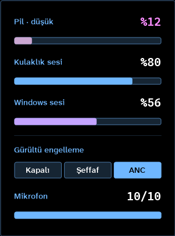

<!-- lang -->

[](README.md)

# HeadsetBatteryTray

Kablolu, kablosuz ve Bluetooth kulaklıklar için Windows tepsisinde kulaklık pili.

| Ölçü | Değer |
|---|---|
| İncelenen popüler kulaklık ([liste](docs/devices.csv)) | 50 |
| Gömülü HeadsetControl ile pil | 50'de 29 |
| Doğrudan HID ile tam panel (ses, ANC, mikrofon) | Arctis Nova Pro Wireless |
| Bağımlılık | 0 (.NET Framework 4, Windows ile gelir) |

## Nedir

HeadsetBatteryTray tek bir Windows tepsi programıdır. Tepsi simgesi kulaklık pilini sayı olarak gösterir; gerçek simge boyutunda keskin çizilir; renk %100 yeşilden %50 maviye, %0 kırmızıya kayar, şarjda beyazdır, %25'te uyarır. Sol tık paneli açar; programı ikinci kez başlatmak da açar.

Pili sırayla üç yoldan okur: SteelSeries Arctis Nova Pro Wireless için doğrudan HID, yaklaşık 40 kablolu ve dongle'lı kulaklık için (SteelSeries, Logitech, Corsair, HyperX, Razer, Roccat, Audeze ve diğerleri) gömülü [HeadsetControl](https://github.com/Sapd/HeadsetControl), Bluetooth kulaklıklar için Windows'un Bluetooth pil değeri. Üretici yazılımının açık olması gerekmez.

## Arctis Nova Pro Wireless Paneli

Nova Pro tam paneli alır: pil, kulaklık sesi, Windows sesi, gürültü engelleme, şeffaflık (yalnız şeffaf modda) ve mikrofon seviyesi.

- **Ses aktarımı (20-80).** Kulaklık %20 ile %80 arasında kalır. Tekerlek %80'i geçince fazlası Windows'a gider; %20'nin altında fark Windows'tan düşer. Geri dönüşte önce Windows %50'ye doğru hareket eder, sonra kulaklık izler.
- **%1 hassasiyetle pil.** Nova pili %12,5 adımlarla bildirir. Tepsi bu adımların arasını %1 adımlarla sayar; hızı, önceki boşalmalarda her yüzdenin ne kadar sürdüğünden gelir. Kullandıkça öğrenir: ayrı bir ölçüm gerekmez, sessiz geçen zaman dinlemekten az sayılır. Bir sonraki cihaz adımını asla geçmez: 25 ile 12 arasında 13'te bekler. İpucu cihaz aralığını ve kalan süreyi gösterir. Menüdeki "Pil tahmini (%1 adım)" ile kapatılır.
- **Yuvarlak sayılar.** İki ses çubuğu da %5 adımlara oturur.
- **Cihaza kaydedilir.** Değişiklikler son dokunuştan 0,8 sn sonra baz istasyonuna yazılır, kapatıp açınca kaybolmaz.

Diğer kulaklıklar yalnız pil panelini alır. Kulaklık bulunamazsa panel bunu söyler ve **Yeniden ara** düğmesini gösterir.

Panel klavyeyle kullanılır: Tab ya da ok tuşları satırlar arasında gezer, Sol/Sağ değeri ya da modu değiştirir, Home/End uçlara atlar, Enter düğmeye basar, Esc kapatır. Windows ekran ölçeğine ve Windows animasyon ayarına uyar.

## Ne Yapmaz

- EQ düzenleme, Sonar, ChatMix, firmware güncelleme yok.
- Başka markalar için kendi sürücüsü yok. HeadsetControl'ün tanımadığı bir kulaklığı [oraya istemek](https://github.com/Sapd/HeadsetControl/issues) en iyisidir; onu kullanan her araç kazanır. [Bize de yazabilirsiniz](../../issues/new?template=device.yml).
- Nova fabrika ayarı komutunu (`06 FD`) asla göndermez.
- Yalnız Windows.

## Kurulum

[Son sürümden](../../releases/latest) `HeadsetBatteryTray.exe` dosyasını indirip çalıştırın. Kendini başlangıca ekler; durdurmak için sağ tık menüsünde "Windows ile başlat" işaretini kaldırın. Sürüm, sağ tık menüsünün en üstünde ve exe'nin dosya özelliklerinde yazar.

## Nasıl Çalışır

Nova baz istasyonu üreticiye özel bir HID arayüzü sunar (arayüz 4). Komutlar `0xFFC0` koleksiyonuna `06` ile başlayan 64 baytlık raporlar olarak gider; olaylar `0xFF00` üzerinden `07` ile başlayarak gelir.

| Komut | Anlamı |
|---|---|
| `06 B0` | durum: pil `[6]`, kulaklık durumu `[15]`, şeffaflık `[8]`, ANC modu `[10]` |
| `06 20` | ses durumu: ses `[3]`, mikrofon `[17]` |
| `06 25 v` | kulaklık sesi, 0 = en yüksek, 56 = sessiz |
| `06 BD m` | 0 kapalı, 1 şeffaf, 2 ANC |
| `06 B9 l` | şeffaflık seviyesi 1-10 |
| `06 37 l` | mikrofon seviyesi 1-10 |
| `06 09` | ayarları cihaza kaydet |

Nova yoksa dakikada bir bakar: önce `headsetcontrol -b -o json`, sonra Windows'un Hands-Free cihazlar için tuttuğu Bluetooth pil değeri.

## Program Ne Yaptığını Gösteriyor



## Geliştirme

```powershell
powershell -ExecutionPolicy Bypass -File build.ps1
```

Programın tamamı `src/HeadsetBatteryTray.cs`. `build.ps1`, `vendor/headsetcontrol.exe` varsa onu gömer. `test/komut-dene.ps1 -Komut 06-B0` tek bir ham rapor gönderir; `test/onizleme.ps1` simgeyi, menüyü ve panelin her hâlini %100/125/150'de PNG'ye çizer; `test/panel-test.ps1` yerleşimi, klavyeyi ve fareyi başsız dener; `test/kontrast.ps1` her renk çiftini ölçer; `test/pencere.ps1` çalışan paneli yakalar; `test/hc-coz.ps1` ve `test/bt-pil.ps1` HeadsetControl ve Bluetooth okuyucularını dener.

## Üçüncü Taraf Yazılım

Sürüm dosyaları, Denis Arnst ve katkıcılarının [HeadsetControl](https://github.com/Sapd/HeadsetControl) 4.1.0 sürümünü değiştirilmeden içerir, lisansı GPL-3.0'dır. Ayrı bir program olarak çalıştırılır; kaynağı yukarıdaki bağlantıdadır. Bkz. [docs/licenses.md](docs/licenses.md).

## Katkı

Önce bir issue açın: [hata bildirimi](../../issues/new?template=bug.yml) ya da [kulaklık desteği isteği](../../issues/new?template=device.yml). Pull request'leri küçük tutun. Depo dili İngilizcedir. Katkılar proje lisansı altında kabul edilir. HeadsetBatteryTray size zaman kazandırıyorsa [destek olmak](https://github.com/sponsors/Teknesyum) sürmesini sağlar.

## Lisans

AGPL-3.0-or-later. Bkz. [LICENSE](LICENSE).

<!-- signature -->
<div align="center">

<a href="https://github.com/sponsors/Teknesyum"></a>
&nbsp;
<a href="LICENSE"></a>

</div>
